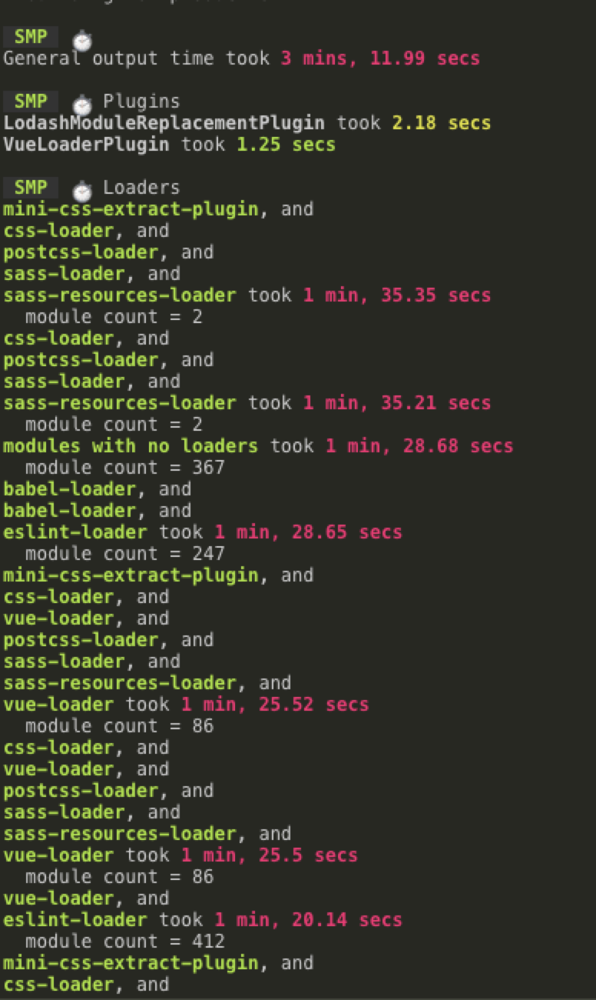
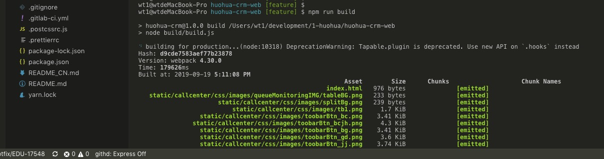
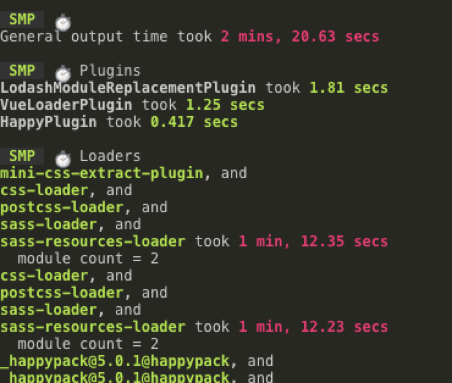
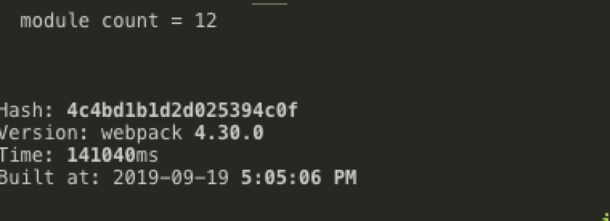
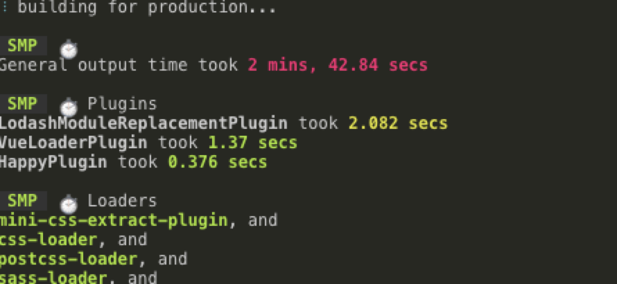
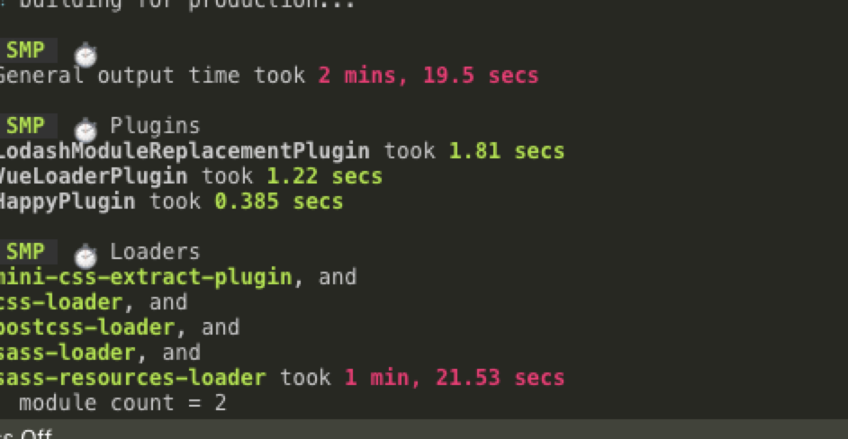
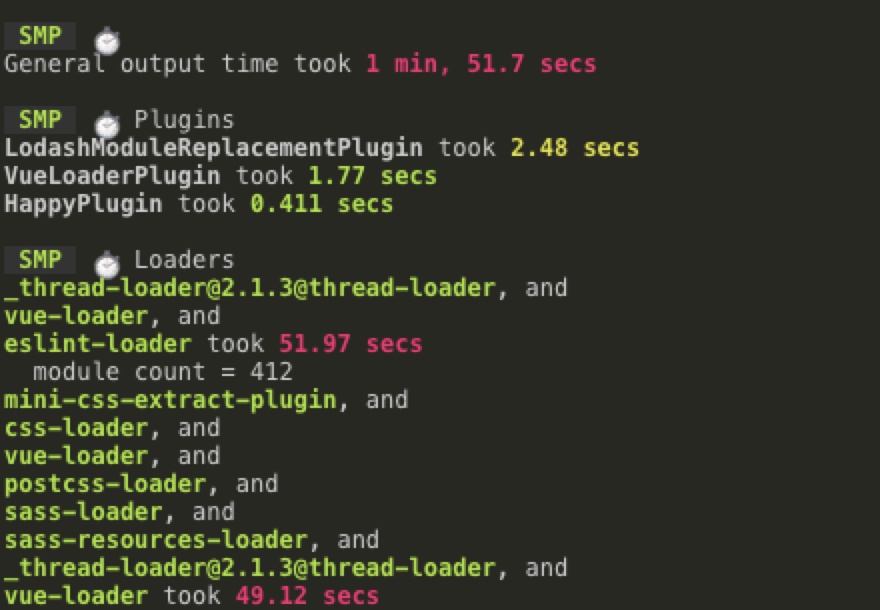
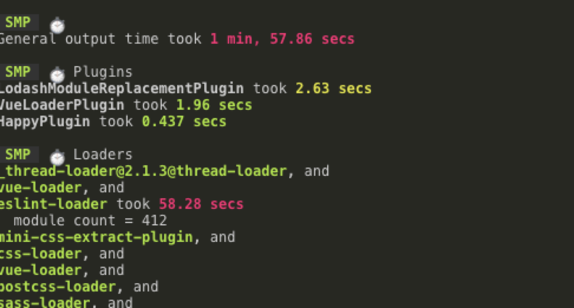
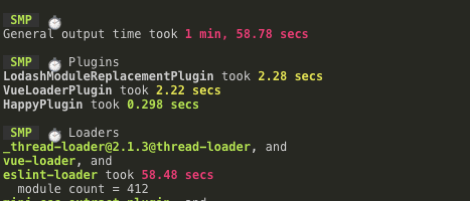

一、优化策略： 缓存、多核、抽离或拆分

*  缓存添加：

1. babel-loader缓存 通过设置cacheDirectory为true来开启缓存
```js
{
    test: /\.js$/,
    loader: 'babel-loader',
    options: {
      cacheDirectory: true
    }
  },
```

* 多核 
1. 引入happypack 插件

```js
 cnpm i happypack
```
2、对于大的模块引入thread-loader
```js
rules [
    {
        test: /\.vue$/,
        use: ['thread-loader','vue-loader'],
    },    
]
```     
3、抽离和拆分
```js
//1、
    optimization.runtimeChunk = 'single'  //抽离公共的运行时代码
//2、
    optimization.cacheGroups: {
          vendors: {
              test: /[\\/]node_modules[\\/]/,
              priority: -10,
              chunks:'async', // 按需加载
          }
      }
//3、dll 将vue vue-router jquery等体积较大的包单独打包，之后webpack每次打包不会继续重新打包
//新增webpack.dll.conf.js 文件内容如下

安装DllPlugin包和DllReferencePlugin包

const path = require('path')
const webpack = require('webpack')

module.exports = {
    entry:{
        //这地方写你想抽离的包，可以参考你的package.json文件下的dependencies
        vue:['vue','vue-router'] 
    },
    output:{
        //这地方写你打包后生成文件的路径
        path:path.join(__dirname,"../src/dll"),
        filename:'[name].dll.js',
        library:'[name]'
    },
    plugins:[
        //这个插件是重点，用于打包上面entry里配置的包
        new webpack.DllPlugin({
            path:path.join(__dirname,"../src/dll",'[name]-manifest.json'),
            name:'[name]',
        }),
        new webpack.optimize.UglifyJsPlugin()
    ]
}

```


三、可进行的其他优化
1、对于callcenter的图片没有用到的删除掉
2、可将callcenter放置在静态资源服务器上，或者CDN引入的方式
3、jquery存在重复引入的问题
4、logo图片优化，当前为48kB logo.svg图片压缩，当前为22K
5、xls模版文档存放在前端，且大小为20-30K左右


### 结论
原来打包时间为3min12s ，经过优化打包时间可到1min 57s左右
1、 主要对vue文件使用thread-loader，设置babel-loader缓存 通过设置cacheDirectory为true来开启缓存
2、 js使用happypack来多核打包 性能优化明显 
3、 dllplugin和 cache-loader 操作对于打包时间优化不是很大


#### 构建过程中分析 原打包时间




#### 加入babel-loader 缓存和happypack 多核打包后



#### 加入cache-loader 打包

未加入cache-loader 查找缓存需要时间


#### 加入thread-loader




#### 抽离与拆分之后

打包时间没有太多变化

### dllplugin 升级



一、优化思路： 添加yarn add speed-measure-webpack-plugin 插件，测量出在你的构建过程中，每一个 Loader 和 Plugin 的执行时长