### 什么是机器学习

机器学习是一门多领域交叉学科，廊括众多：涉及到概率论、统计学、逼近论、凸分析、算法复杂度理论等多门学科。专门研究计算机怎样模拟或实现人类的学习行为，以获取新的知识或技能，重新组织已有的知识结构使之不断改善自身的性能。
它是人工智能的核心，是使计算机具有智能的根本途径。如果以人来说明的话，机器学习相当于人的学习能力和发展能力。
通过将人类学习和机器学习做比对，我们发现，机器学习输入的是数据，学到的结果叫模型（类似函数的映射），从数据中学得模型这个过程是通过执行某个学习算法来完成的。

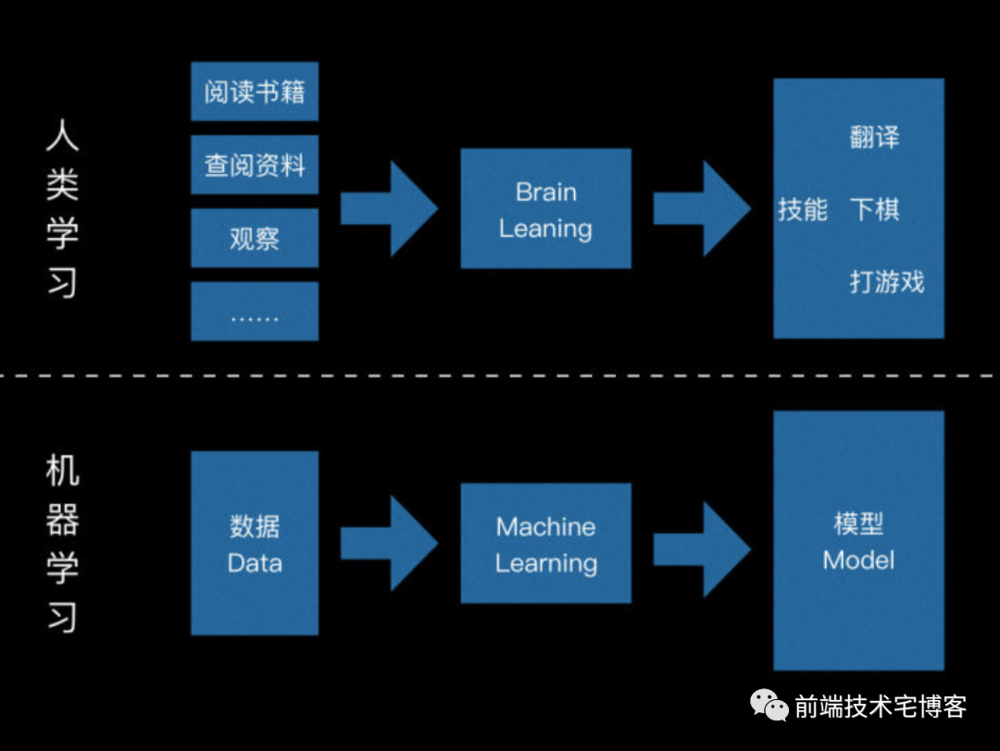
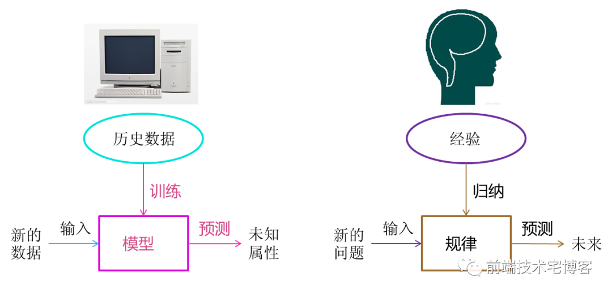

机器能预测，但不能创造新事物，能记忆，但不能快速变聪明；能复制，但无法超出任务范围；能选择最优项，但无法消灭全人类。

### 二. 常见概念区分

| 概念名称 | 具体含义 |
| ----------- | ----------- |
| 人工智能|是一门学科，类似于“生物”或“化学”，其终极目标为实现机器可以想人一样思考，当前发展水平：弱人工智能水平|
| 机器学习|实现人工智能的核心算法|
| 神经网络|机器学习的一种分支方法，很受欢迎|
| 深度学习|机器学习中的一种，主要以神经网络为基础，拥有自适应调节能力关于构建、训练和使用神经网络的一种现代方法，本质上来讲，是一种新的架构|

### 三.  发展历史
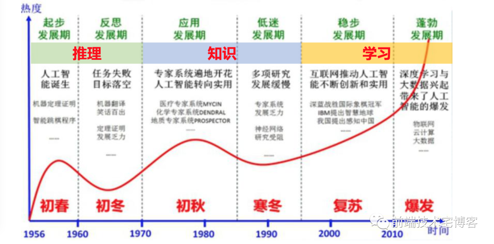
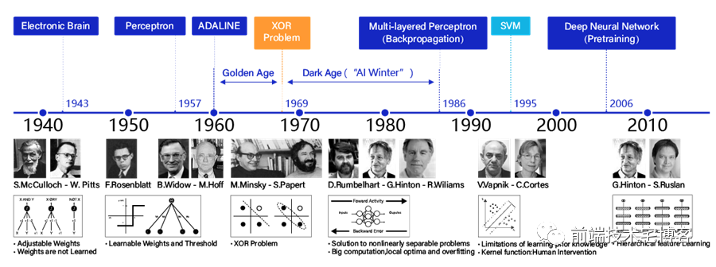

### 四. 现状和应用

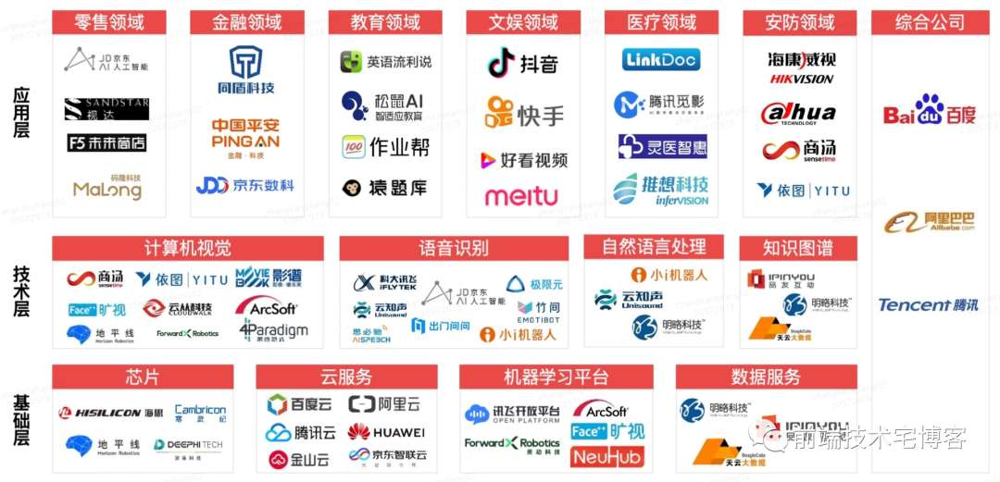
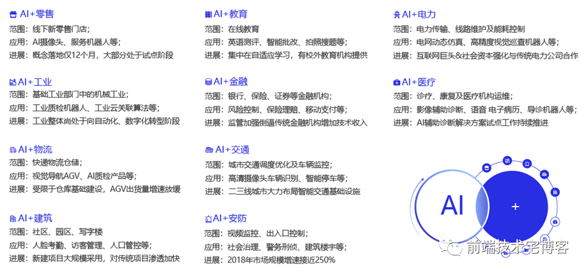

### 五. 机器学习流程
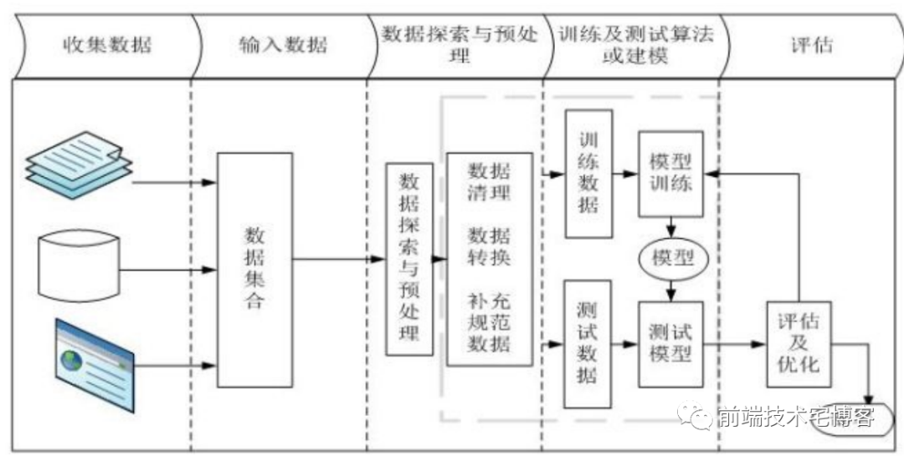
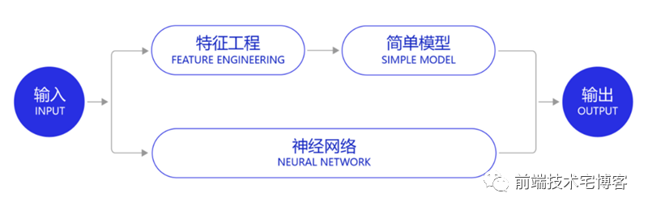

### 六. 常见机器学习算法

在机器学习的世界里，解决问题的方法从来不是唯一的，总会有好几个算法都可以来解决某个问题，你需要做的是：从中选择最合适的那个。

但是，所有的问题又都可以使用“神经网络”来处理，但代价是算力的硬件成本。

经典机器学习算法起源于1950年代的统计学，为了解决诸如寻找数字中模式、估计数据点间的距离以及计算向量方向这类形式的数学问题。

有监督学习
- 线性回归
- 多项式回归
- 朴素贝叶斯
- 决策树
- 逻辑回归
- K近邻
- 支持向量机
- 分类：预测一个对象所属的类别，过滤垃圾邮件、语言检测、查找相似文档、情感分析、欺诈检测等；
- 回归：预测数轴上一个特定点，股票价格预测、供应和销售量分析、医学诊断、计算时间序列相关性；

无监督学习
- Apriori
- Euclat
- FP-growth
- 主成分分析PCA
- 奇异值分解SVD
- 潜在狄利克雷特分配LDA
- 潜在语义分析LSA
- t-SNE(用于可视化)
- K均值聚类
- Mean-Shift
- DBSCAN
- 聚类：市场细分、图像压缩、检测异常行为、合并地图上邻近的点；
- 降维：推荐系统、可视化、主题建模和查找相似文档、假图识别、风险管理
- 关联规则学习：预测销售和折扣、分析一起购买的商品、规划商品陈列、分析网页浏览模式

神经网络分类

1. 有监督的神经网络

- 神经网络(Artificial Neural Networks)和深度神经网络(Deep Neural Networks)，ANN&DNN
 
- 循环神经网络(Recurrent Neural Networks)和递归神经网络(Recursive Neural Networks)，RNN

- 卷积网络(Convolutional Neural Networks)，CNN

2. 无监督的神经网络

- 深度生成模型(Deep Generative Models)，DGM

- 玻尔兹曼机(Boltzmann Machines)和受限玻尔兹曼机(Restricted Boltzmann Machines)，BM&RBM

- 深度信念网络(Deep Belief Neural Networks)，DBNN

- 生成式对抗网络(Generative Adversarial Networks)，GAN

举例讲解算法思想
- 线性回归

我们现在要做一个预测房价的模型，首先抽象逻辑定义模型：假设影响房价的因素只有住房面积，假设：y=房价，x=住房面积，则定义模型：y=a*x+b其中x为特征变量，a、b为参数。因此我们的目的就是利用训练数据，去确定参数a、b的值。

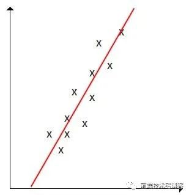

定义好模型后，需要考虑满足什么样条件的参数模型才是最好的，即需要定义代价函数，这里以每个点到直线的距离和计算，最好的模型应该就是距离和最小

接下来就是通过数据训练了，训练的数据和量会导致最终模型参数有差异。但是在现实问题中，可能房价跟住房面值不是单纯的直线关系，当住房面积到一定大的时候，房价的增幅就会变缓了；或者说当数据量不够大时，我们得到的模型跟测试数据太拟合了，不够通用。为了解决这些问题，我们就需要正则化，就是让模型更加的通用。
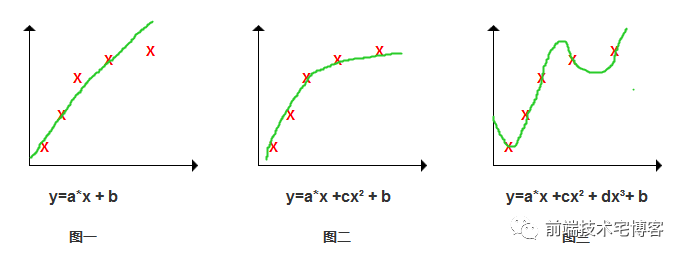

总结：线性回归的特点是主要解决连续值预测的问题，输出的是数值.

- 决策树模型

定义：决策树是附加概率结果的一个树状的决策图，是直观的运用统计概率分析的图法，使用层层推理来实现最终的分类。机器学习中决策树是一个预测模型，它表示对象属性和对象值之间的一种映射，树中的每一个节点表示对象属性的判断条件，其分支表示符合节点条件的对象。树的叶子节点表示对象所属的预测结果。根节点代表选择的内容，叶子节点代表决策的结果。

简单案例：预测贷款人是否有能力偿还贷款

- K-Means

计算质心，聚类无标签数据
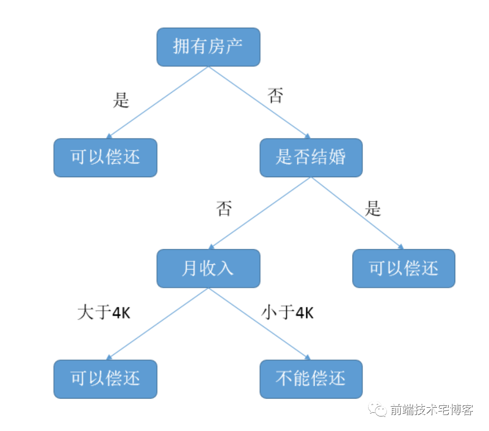

K-Means算法是一种常见的聚类算法，其基本步骤为：

（1）随机生成k个初始点作为质心；

（2）将数据集中的数据按照距离质心的远近分到各个簇中；

（3）将各个簇中的数据求平均值，作为新的质心，重复上一步，直到所有的簇不再改变。

主要应用：客户价值分析

- 神经网络和深度学习

神经网络模拟人脑神经网络而设计的模型，由多个节点（人工神经元）相互联结而成，可以用来对数据之间的复杂关系进行建模。不同节点之间的连接被赋予了不同的权重，每个权重代表了一个节点对另一个节点的影响大小。每个节点代表一种特定函数，来自其他节点的信息经过其相应的权重综合计算。是一个可学习的函数，接受不同数据的训练，不断通过调整权重（梯度下降、反向传播）而得到契合实际模型,一个三层的神经网络可以逼近任意的函数。

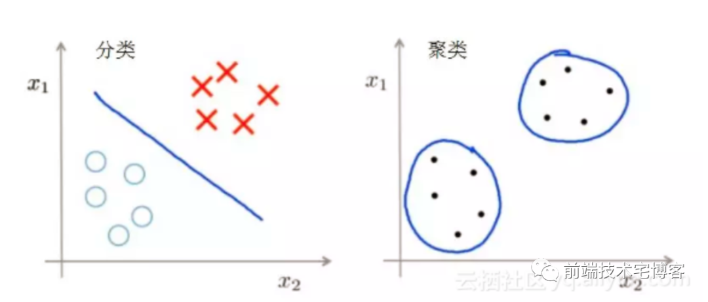

深度学习本质上由一个个神经元组成。如图每一个点都是一个神经元，它可以接收很多的信号，之后通过它自己的办法做计算（加权平均或者做卷积等等），然后产出一个结果，再发给一些其他的节点，这就是一个神经元。大家发现把很多个神经元这样组合起来，然后把很多的data、output不停地输入到神经元里，最终它会自己学习得把加权平均里的很多的参数、权重都做得非常得优化非常得好，比人手工去写很多的规则、写很多特征的传统的机器学习要好得多。这就是深度学习的思想。

深度学习是很多层的，要去选择很多的网络结构。比如说神经元里，每一层它可以有（数据的）输入层，有的层可以做卷积运算，有的层可以做池化，有的层把结果全连接或者做激励，它每一层可以做的东西很不一样。怎么把这些层比较好地进行组合产出一个比较好的神经网络呢？在深度学习产生的头几年，大家将这样那样的算法比来比去，其实比的就是谁选的网络结构是比较好的。然后就产生了很多种不同的深度学习的框架，比如深度神经网络、卷积神经网络、深度置信网络等等。

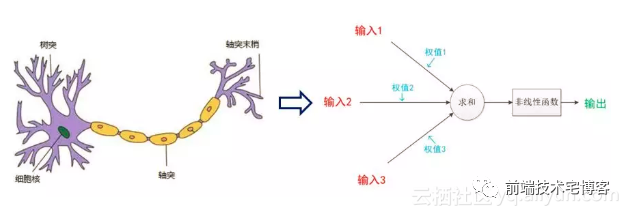

如何选择算法呢？从问题本身、标签的类型、数据集的大小、特征的数量、计算时间的要求、以及模型的可解释性这些方面，来比较和选择算法。

### 七. 其他：当前面临的问题、未来发展趋势、和运维的结合

现在大部分的人工智能的算法需要很大量的训练数据，小数据样本很难操作。

深度学习网络里面的参数到底怎么调、特征到底怎么选，根本不知道，都是给它大量的数据让它不断地学不断地学。这就导致一旦出问题会是一些非常诡异的问题，然后还很难找到这个问题是什么。而且很多时候我们发现这个学习是一次性的——对这堆数据学了之后，它可以得出一个样本，但是当我想再加一点要求，再加一点数据，再加一点背景时，会发现原来学习的这个模型什么用都没有了，很多时候要重新去学。现在的很多算法是缺乏增量学习的能力的。
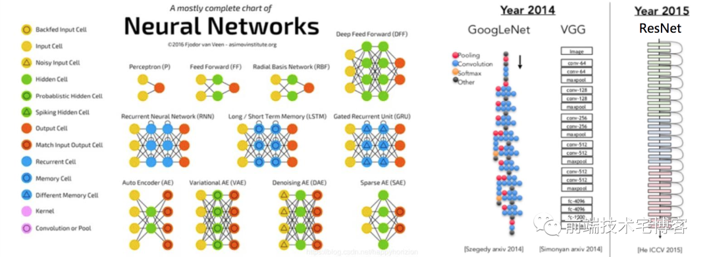

如果更长期地看，2017年美国有一个网站叫Business Insider（《商业内幕》/《商业内参》），发表了一个文章用了，说我们现在的很多工作未来在什么时间会被机器所替代。这里边有几个比较有意思的，比如说它认为可能到二零零几年的时候，基本上语言的翻译就可以实现。现在我们看Siri、Google Assistant、国内的讯飞等已经能比较好地翻译语音了。然后它认为到2030年左右机器可以去开一辆卡车，就是自动驾驶应该到了L4的阶段，可以去驾驶卡车。还有一些很有意思，我们之前认为还是要保留一些人类的自留地的，一些涉及情感、审美、艺术创作的东西是我们人类的最后领地。但是我们会看到，比如说到2030年左右，排行榜上的这种歌曲就可以由机器来产生；再往后看，大概在2050年左右机器就可以写畅销书了。我不知道是乐观还是悲观，他们认为2060年左右所有人类工作基本上都可以被机器替代。当然这是这家杂志的观点，具体是不是对的我们可以讨论。但的确我们觉得人工智能未来会在社会中产生越来越大的作用。

